# MicroBlaze Tutorial

## Tutorial Overview

In this tutorial, you will be introduced to the tool flow for simple MicroBlaze designs.  Specifically, you will create a design that continuously reads the input from UART and writes that value to the LEDs.

## System Requirements

You must complete the following installation items before you can follow the steps of this tutorial:

- Install Xilinx ISE 14.X System Edition.  This includes ISE Project Navigator, PlanAhead, Software Development Kit, and Platform Studio.
- Download the Atlys_BSB_Support_v_3_6.zip from the Digilent Atlys support site.
  - Extract this folder to a permanent location on your computer.
  - This tutorial assumes you have it extracted to: `C:/Xilinx/Atlys_BSB_Support_v_3_6`
  - **Ensure you run the `inst_uninst` batch file in the `Digilent_AXI_IPCore_Support_v_1_33` folder!**
- From the Digilent website, download and install the "Digilent Plugin for Xilinx Tools."
  - The installation instructions are included as a PDF in the downloaded zip file.
  - This is the most important paragraph in the installation instructions: *The Digilent Plug-in can be installed in the ISE installation directory by copying libCseDigilent.dll (libCseDigilent.so on Linux systems) and libCseDigilent.xml to the plugins directory. For the Windows version of ISE Design Suite, the typical location is `C:\Xilinx\14.1\ISE_DS\ISE\lib\nt\plugins\Digilent\libCseDigilent`. For 64-bit Windows, use nt64 inplace of nt.*

## Create Basic Hardware Platform (UART)

The steps in this section will guide you through the process of creating a hardware platform for your embedded FPGA design.  The ultimate product is a bitfile you can use to download to your FPGA.

- Open Xilinx Platform Studio

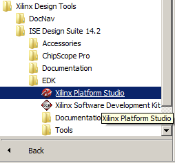

- Click "Create New Project Using Base System Builder"


- In the first window of the wizard:

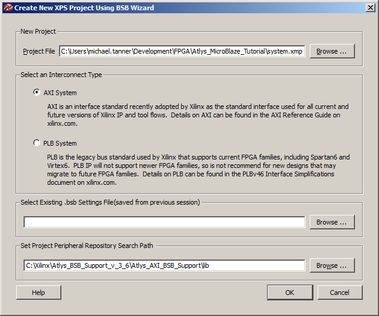

  - Under "New Project," browse to the folder you would like to save your project files.  Note: This does not create a subdirectory for you!
  - Select the "AXI System" as your interconnect type
  - Under "Set Project Peripheral Repository Search Path," enter the location you extracted the Atlys support zip file.  Note: You must select the "Atlys_AXI*/lib" subdirectory.
  - Click "OK"
- Now you enter into the Base System Builder wizard setup, which is specific to the Atlys board.  This wizard will set which board you are working with, how to configure the MicroBlaze processor(s), and which peripherals you will need.  In general, leave everything to their default values, except where noted here.
  - First window: Select the Digilint Atlys board, Revision C

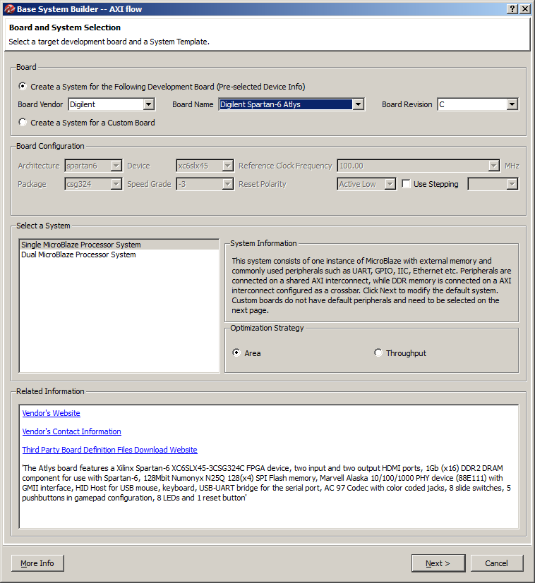

  - Second window: Remove all the peripherals in the bottom portion of the window. 

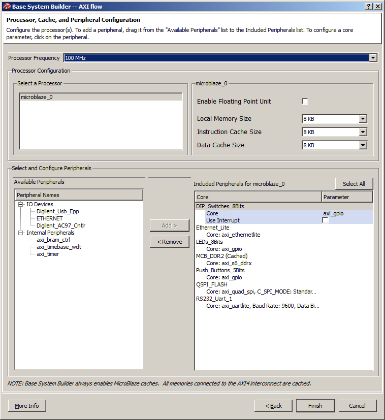

- There are three main tabs under the "System Assembly View" that you will work with.


  - Bus Interfaces - This is where you will connect your peripherals to various busses.  For our design, everything will be connected to the same bus as the MicroBlaze processor.
  - Ports - This is where you define how the input/output ports from the various peripherals connect to FPGA pins.  The names of the pins/ports are listed under this tab, but you still have to modify the UCF to specify which physical pin you are connected to on the FPGA.
  - Addresses - This is where you specify the memory-mapped address range for each peripheral.  You need to be careful to give a large enough address block to cover all the software registers available in that peripheral.  For peripherals you have not created, you can look at the datasheet for help on the needed memory size.
- There are two tabs under the side window that are also useful.


  - IP Catalog - this is a list of available peripherals that you can connect to your MicroBlaze processor.  We will use the "UART Lite" peripheral to communicate our UART-to-USB connection your computer.
  - Project - This is where you can access the "raw" files that Platform Studio manages for you
    - UCF File - where you name/configure the FPGA pins
    - MHS File - where the peripherals configuration is stored (address, ports, bus, etc.)
- Add an "AXI UART (Lite)" peripheral from the IP Catalog


  - Baud Rate: 9600
  - Number of Bits: 8
  - Parity: False
- Under the "Bus Interfaces" tab, ensure the `axi_uartlite_0` peripheral is connected to the same bus as MicroBlaze.  This lets the UART module communicate with your MicroBlaze processor.


- Under the "Ports" tab, connect the RX and TX lines for the `axi_uartlite_0` to external pins.  This just gives the name of the port to look for in the UCF file.


-  Under the "Addresses" tab, change the base address for `xps_uartlite_0` to `0x84000000` with a size of `64K`


- Finally, add the following lines to the UCF file so that the UART peripheral knows which pins to use for RX and TX:
`net axi_uartlite_0_RX_pin LOC=A16 | IOSTANDARD = LVCMOS33;`

`net axi_uartlite_0_TX_pin LOC=B16 | IOSTANDARD = LVCMOS33;`
- Finally, click the "Generate BitStream" button to create your hardware bitfile.  Note: This process will take about 10 minutes!  For a more complicated design, it can take hours or days.

## Write Simple Software

Now that the hardware is designed, you can write software to run on your embedded MicroBlaze hardware platform.  In this section, you will write the needed C code to interface with MicroBlaze and its UART peripheral.

- Click the "Export Design" button, and then select "Export & Launch SDK."  Make sure the "Include bitstream and BMM" checkbox is checked.


- Xilinx SDK will ask you where you want to place your "workspace."  Create a new folder somewhere on your computer where you will store the source projects for this tutorial.

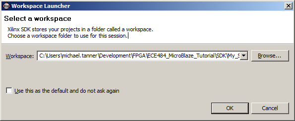

- Click File -> New -> Application Project
- Name your project anything you want (without spaces!), and then click "Next."

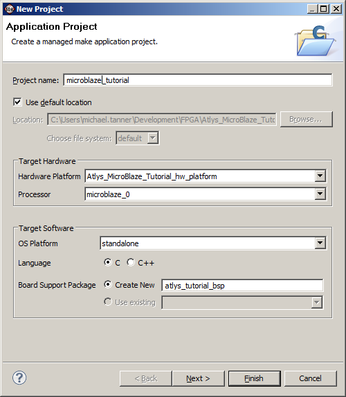

- Select "Empty Application"

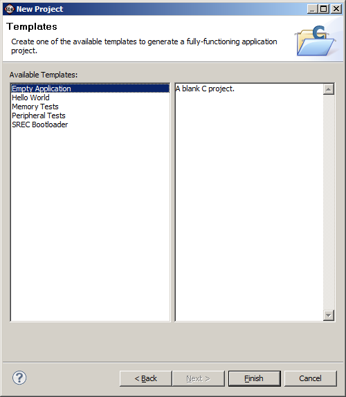

- In the `src` folder of your new project, create a new C source file named `main.c`.

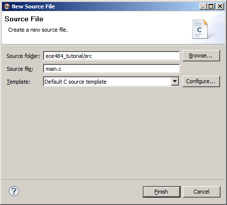

- Type the following code into the new file:

```c
#include <xuartlite_l.h>
#include <xparameters.h>

int main(void)
{
 while (1)
 {
  unsigned char c;
  c = XUartLite_RecvByte(0x84000000);
  XUartLite_SendByte(0x84000000, c);
 }

 return 0;
}
```

## Run & Debug Software

This section will guide you through the process of downloading your code (`.elf` file) and hardware (`.bit` file) onto the FPGA.  You will even learn how to debug your code, including breakpoints and looking at registers/variable values, real-time on the FPGA hardware.

1. Go to Xilinx Tools -> Configure JTAG Settings
2. Under "Type," select "Digilent USB Cable" and then click "OK"

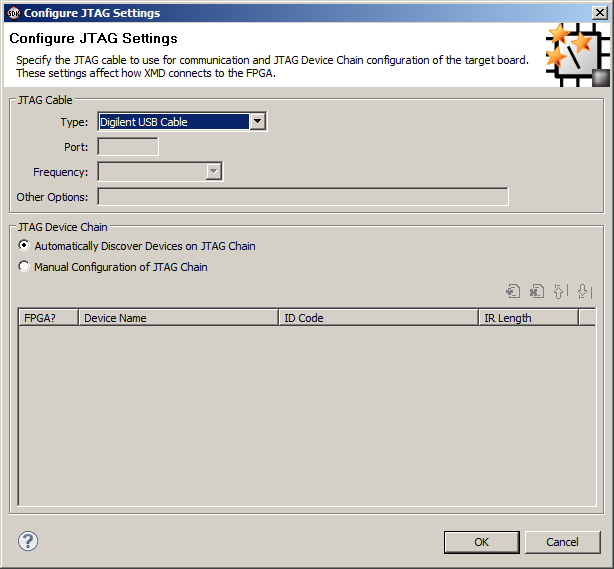

3. Click the "Program FPGA" button 
4. Under the software configuration, choose the `*.elf` file that matches the name of your project.  Then click "Program"

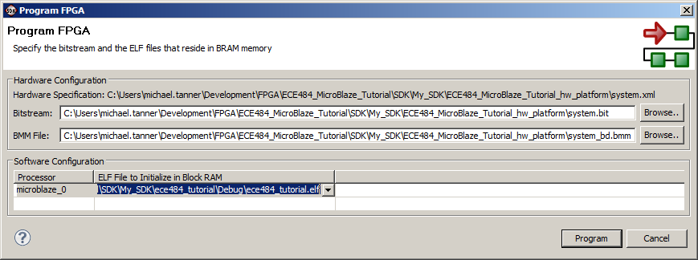

5. Once this process is complete, you can now open up your favorite serial terminal and see your characters echoed back from the FPGA.  Congratulations! You have created your first embedded MicroBlaze FPGA system!
6. If you need to debug your software code, you can click the  button, "Launch on Hardware", to get a full debug interface.  From this debug window, you can step through the code, observe register/ variable values, set debug points, etcetera. [Note: When I did this in Xilinx 14.4, I needed to add a "Debug Configuration" of "Xilinx C/C++ ELF" in order to get the correct debug setup.  I left all the default settings, and it worked correctly with the hardware.]
7. What if you need to debug hardware?  Well, you should use a combination of robust simulations, hardware logic analyzers, and (if necessary) ChipScope.  The last option is beyond the scope of this course due to time constraints.

## Add Custom IP (LEDs)

Now that we have learned how to work with pre-built hardware IP peripherals, you will now create a simple custom IP peripheral that allows you to access the LEDs from software.

1. In Xilinx Platform Studio, go to Hardware -> Create or Import Peripheral
2. On the next screen, be sure "Create templates for new peripheral" is selected

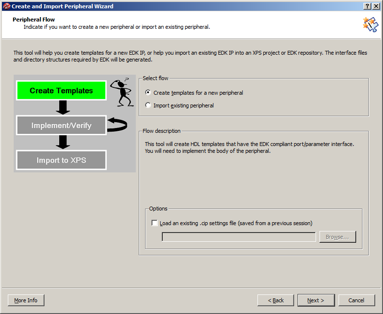

3. On the next screen, create an EDK user repository where you can store all the peripherals you create in this class.  You will probably want to be able to reuse this peripheral in other projects.

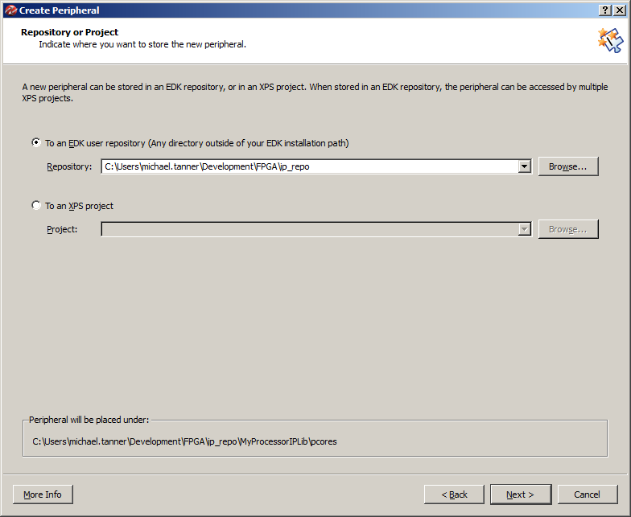

4. Type whatever name (without spaces!) you want for your peripheral.

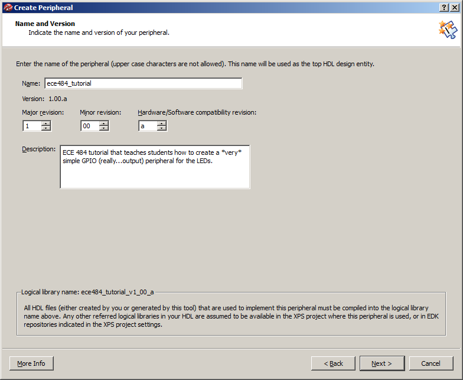

5. The MicroBlaze processor in our design is using the AXI interface.  Be sure to select "AXI4-Lite" as the interface type.


6. Leave "User logic software register" and "Include data phase timer" checked.

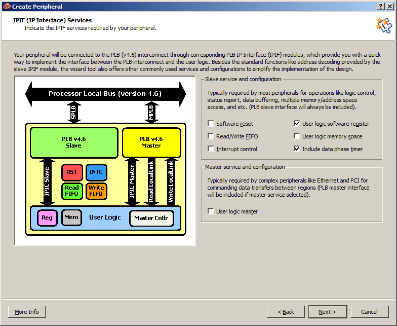

7. Change the number of software-accessible registers to 8.  This will create the boilerplate VHDL code for 8 32-bit registers that you can read from and write to from software.  Eight is overkill for this example, but the VHDL code will illustrate how to expand your design to include more registers.

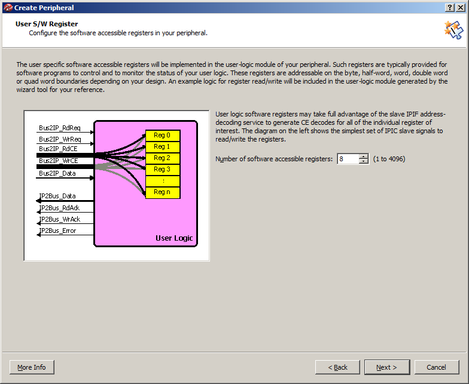

8. Leave the defaults on the IP Interconnect screen.

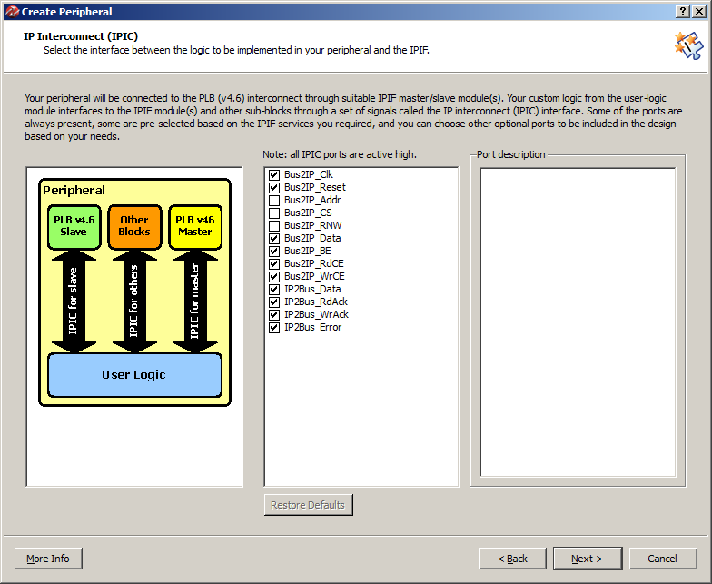

9. You do not need to create a simulation platform for this example.

10. Check the "Generate ISE and XST project files..." checkbox.

11. Click Finish

12. You have created the custom peripheral.  Now you need to update the "user logic" in the peripheral to implement the functionality you desire.
13. Using your file browser, go to the location you saved your repository.  In my case, this is: `C:\Users\michael.tanner\Development\FPGA\ip_repo\MyProcessorIPLib\pcores\microblaze_tutorial_v1_00_a`
14. You will see three different folders that make up your custom peripheral:
a. data - this contains the "settings" for your peripheral.  In particular, you may need to modify the `*.mpd` and `*.pao` files.  XPS uses these files to determine the "interface" to your custom IP peripheral.
i. The `*.mpd` file can be used to specify "ports" that will be connected to FPGA pins under the "Ports" tab of XPS.
ii. The `*.pao` file lists all the VHDL files you need to build your peripheral.  If you add a separate file (e.g., video synchronization), you need to list it in this file.  Order matters, so place the dependent files last.
b. devel - this contains the automatically generated project navigator files to help you develop and simulate your hardware design.
c. hdl - this contains the actual VHDL files that implement the logic of your design.  If you add VHDL files to the peripheral, this is the directory you place them in.
15. To create our custom peripheral that allows up to write any value to the LEDs, we will take the following steps:
a. Modify the `*.mpd` file to let XPS know about the "LED" port it can be connected to FPGA pins through your project’s UCF file.
b. Modify the "your_peripheral.vhd" (the name of your peripheral) to add the "LED" output and then connect it into the structural instantiation of your "user logic."
c. Modify the "user_logic.vhd" file to include an LED output, and then connect one of the pre-created software registers to the LED output.
d. Add the peripheral to our XPS design
e. Generate the bitfile
16. First we need to modify the `*.mpd` file to let XPS know about the "LED" port it can be connected to FPGA pins through your project’s UCF file.  Add the following line to your `*.pao` file in the "ports" section:
PORT LED = "", DIR = O, VEC=[7:0]
17. Now we need to modify the "your_peripheral.vhd" (the name of your peripheral) to add the "LED" output and then connect it into the structural instantiation of your "user logic."
a. In the entity definition for your top-level peripheral VHDL file, find the "ADD USER PORTS BELOW THIS LINE" comment.  Add the following port:
LED : out std_logic_vector(7 downto 0);
b. In the structural instantiation of the user logic file, find the "MAP USER PORTS BELOW THIS LINE" comment.  Add the following port map:
LED => LED,
18. Modify the "user_logic.vhd" file to include an LED output, and then connect one of the pre-created software registers to the LED output.
a. In the entity definition for user logic VHDL file, find the "ADD USER PORTS BELOW THIS LINE" comment.  Add the following port:
LED : out std_logic_vector(7 downto 0);
b. Find the "USER logic implementation added here" comment.  Add the following line:
LED <= slv_reg0(24 to 31);
c. At this point, you have completed the custom logic for your peripheral.  However, take the time to look at the two process statements below your user logic.
i. The first process is used to write to software registers.  In other words, the software is writing a value, and your user logic is storing it into one of the "slv_reg*" registers.
ii. The second process is used to read from software registers.  In other words, the software is reading a value, and your user logic is writing the  "slv_reg*" register  value onto the data bus.
iii. In the next lab (and probably your final project), you will need to modify this slave register read/write logic to implement the required functionality.
iv. In addition, you may need to structurally instantiate some other logic you have created.  Be sure you update your `*.pao` file to include any additional VHDL files required in your design.  Also, make sure your files are in the correct library.
19. Add the peripheral to our XPS design
a. From the IP catalog, add your peripheral

b. Under the "Bus Interfaces" tab, add the peripheral to the same bus as your MicroBlaze processor.

c. Under the "Ports" tab, make an external connection for your peripheral’s LED port.

d. Add the following lines to your UCF file:
net microblaze_tutorial_0_LED_pin(7) LOC=N12 | IOSTANDARD = LVCMOS33;
net microblaze_tutorial_0_LED_pin(6) LOC=P16 | IOSTANDARD = LVCMOS33;
net microblaze_tutorial_0_LED_pin(5) LOC=D4 | IOSTANDARD = LVCMOS33;
net microblaze_tutorial_0_LED_pin(4) LOC=M13 | IOSTANDARD = LVCMOS33;
net microblaze_tutorial_0_LED_pin(3) LOC=L14 | IOSTANDARD = LVCMOS33;
net microblaze_tutorial_0_LED_pin(2) LOC=N14 | IOSTANDARD = LVCMOS33;
net microblaze_tutorial_0_LED_pin(1) LOC=M14 | IOSTANDARD = LVCMOS33;
net microblaze_tutorial_0_LED_pin(0) LOC=U18 | IOSTANDARD = LVCMOS33; 
e. Under the "Addresses" tab, change the base address for your custom peripheral to 0x83000000 with a size of 64K.

f. Note: If you ever make changes to your peripheral (pao, vhdl, mpd, etc.), you can update your XPS project by going to Project → Rescan User Repositories
20. Generate the bitfile
21. Export the design to Xilinx SDK
1.8 Update Software
Finally, you will write software that reads in a value from UART, echoes that value to the UART and LEDs.
1. Confirm that you want to import the new bitfile and design to your SDK project.
2. Add the following lines to your main.c file, where you deem appropriate:
#include <xil_io.h>
Xil_Out32(0x83000000, c);
3. Program the FPGA with your new bitfile and elf file.
4. Run your favorite terminal program to verify that the FPGA is echoing your characters to your terminal and the LEDs.
5. Note: look through the "xil_io.h" file to see the different options you have to read from and write to memory.  These are just simple macros that provide you shortcuts to perform memory operations.  All of this should be review from when we first introduced you to the C programming language.
1.9 Conclusion
We have covered quite a lot of ground in this tutorial.  It is critical that you understand each step of this development process, as this is critical to your next lab and the final project.  Be sure you ask your instructor if you are unsure about anything we covered in this tutorial.  Specifically, you should understand the following:
1. Create an embedded MicroBlaze hardware platform with Xilinx Platform Studio
2. Add a standard peripheral component:
a. Connect it to the MicroBlaze bus
b. Configure its memory-mapped address
c. Connect input/output ports to FPGA pins
3. Create and add a custom peripheral:
a. Make individual read/write registers available from software
b. Structurally add additional VHDL modules in separate files
4. Write software to interface with any given MicroBlaze peripheral.  In particular, you should be able to write to and read from the peripheral’s software registers.
5. Test and debug your software/hardware on the FPGA.
