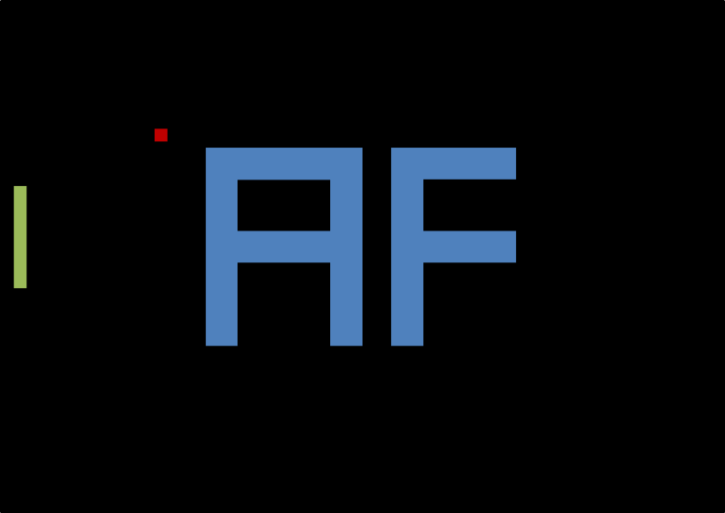

# Lab 2 - Pong

## Lab Overview

In this lab, you will build upon the modules created in the VGA laboratory assignment to implement a simplified version of the classic Pong video game.  This laboratory assignment is based on a FSM lab from the 6.111 course at MIT.

## Game Overview

The final video game implementation must have the features listed below.  A sample screenshot is provided in Figure 1.

1. Background image of the "AF" logo
2. User-controllable paddle position on the left side of the screen
3. "Ball" that moves smoothly across the screen
  1. Bounces when it hits the top, right, or bottom walls.
  2. The ball is hidden when it is moving across the logo letters.
  3. When the game is over (i.e., the ball hits the left wall), the ball freezes in position.
4. The game can be restarted by pressing the "reset" button.



**Figure 1**: Sample screen shot of this lab's simplified version of the Pong video game.

## Prelab Assignment

On the first day of the lab, turn in a typed hard copy the following items:

1. Draw the state-transition diagram for your ball movement in `pong_control` module.
2. Describe how you will implement bounds checking.  Provide an example combinational statement that will be used as an input (e.g., `has_hit_paddle`) to your FSM for state-transition determination.
3. Write the register/combinational equations used to update the paddle position.

## Hardware Implementation

You must use a FSM to implement the pong game logic.  The instructor implemented the game logic for this lab using a single FSM contained within your `pong_control` module.  The new entity definitions used by your instructor for this lab are shown on the next-to-last page of this document.  There are two significant changes to the VGA lab assignment:

1. This implementation includes the game-logic module with user inputs for "up" and "down".
2. The pixel generator has the current ball and paddle positions as inputs.

Using this implementation, the `pong_control` FSM stays in an idle state until the current screen refresh is complete.  It leaves the idle state when `v_completed` is pulsed high for one clock cycle.  It then moves through a variety of states to update the ball positions before returning to the idle state.  The paddle position can be updated with a register and simple combinational logic.

The method described above is what was used by the instructor to implement this lab.  However, there are more elegant, modular, and resource efficient ways to implement this game.

Using a more modular hardware design would simplify the addition of game logic - for example, expanding our game to implement a rudimentary version of Breakout or adding a game menu system for high scores, difficulty level, and etcetera.  This is highly desirable if you plan to build on this logic for your final project.

## Lab Hints

- Use a package header to define global constants (e.g, size of `paddle_width`, `ball_radius`; the states common to both FSMs, etc.)
- When checking the boundary conditions within a state, use only one if statement with elsif/else clauses.  Using multiple if statements in parallel can have unintended consequences.  Even better, you can do all your bounds checking with combinational statements.  This is less likely to have unintended consequences.
- Make sure you don't infer any latches in your design!  In the past, this was the cause of most hardware implementation issues.
- Unsure what the hex code for AF blue is?  http://www.rapidtables.com/web/color/RGB_Color.htm

## B Functionality

Change the speed of the ball in real-time based on the switch configuration.  Use a single switch - there should be two possible ball speeds.

## A Functionality

Create different "hot" zones on the paddle.  This would result in the ball bouncing off the paddle at different angles based on where it hits.

## Free Code

```vhdl
entity pong_pixel_gen is
  port (
          row      : in unsigned(10 downto 0);
          column   : in unsigned(10 downto 0);
          blank    : in std_logic;
          ball_x   : in unsigned(10 downto 0);
          ball_y   : in unsigned(10 downto 0);
          paddle_y : in unsigned(10 downto 0);
          r,g,b    : out std_logic_vector(7 downto 0)
  );
end pong_pixel_gen;

entity pong_control is
  port (
          clk         : in std_logic;
          reset       : in std_logic;
          up          : in std_logic;
          down        : in std_logic;
          v_completed : in std_logic;
          ball_x      : out unsigned(10 downto 0);
          ball_y      : out unsigned(10 downto 0);
          paddle_y    : out unsigned(10 downto 0)
  );
end pong_control;

entity atlys_lab_video is
  port (
          clk   : in  std_logic; -- 100 MHz
          reset : in  std_logic;
          up    : in  std_logic;
          down  : in  std_logic;
          tmds  : out std_logic_vector(3 downto 0);
          tmdsb : out std_logic_vector(3 downto 0)
  );
end atlys_lab_video;
```

**Code Listing 1** - Entity templates for the lab to ensure consistency between student designs.

## Grading

| Item | Grade | Points | Out of | Date | Due |
|:-: | :-: | :-: | :-: | :-: |
| Prelab | **On-Time:** 0 ---- Check Minus ---- Check ---- Check Plus | | 10 | | BOC L13 |
| Required Functionality | **On-Time** ------------------------------------------------------------------ **Late:** 1Day ---- 2Days ---- 3Days ---- 4+Days| | 40 | | COB L15 |
| B Functionality | **On-Time** ------------------------------------------------------------------ **Late:** 1Day ---- 2Days ---- 3Days ---- 4+Days| | 10 | | COB L15 |
| A Functionality | **On-Time** ------------------------------------------------------------------ **Late:** 1Day ---- 2Days ---- 3Days ---- 4+Days| | 10 | | COB L15 |
| Use of Git / Github | **On-Time:** 0 ---- Check Minus ---- Check ---- Check Plus ---- **Late:** 1Day ---- 2Days ---- 3Days ---- 4+Days| | 5 | | COB L16 |
| Code Style | **On-Time:** 0 ---- Check Minus ---- Check ---- Check Plus ---- **Late:** 1Day ---- 2Days ---- 3Days ---- 4+Days| | 5 | | COB L16 |
| README | **On-Time:** 0 ---- Check Minus ---- Check ---- Check Plus ---- **Late:** 1Day ---- 2Days ---- 3Days ---- 4+Days| | 20 | | COB L16 |
| **Total** | | | **100** | | |
