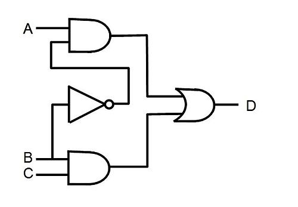

# Lesson 1 Homework

1. [1.1] An engineer claims the following about the digital format: "In a digital system, logic '0' and logic '1' are represented by two voltage levels. Since there is a significant voltage difference between the two levels, noise will not affect the logic value, and thus digitized information is immune to noise."  Is this statement correct? Explain.
2. [1.2] Volume of sale (i.e., the number of parts sold) is a factor when determining which device technology is to be used. Assume that a system can be implemented by FPGA, gate array or standard-cell technology. The per-part cost is $15, $3, and $1 for FPGA, gate array, and standard cell respectively. Gate-array and standard-cell technologies also involve a one-time mask generation cost of $20,000 and $100,000 respectively.
  1. Assume the number of parts sold is N. Derive the equation of per-unit cost for the three technologies.
  2. Plot the equations with N as the x-axis.
  3. Determine the range of N for which FPGA technology has the minimal per-unit cost.
  4. Determine the range of N for which gate-array technology has the minimal per-unit cost.
  5. Determine the range of N for which standard-cell technology has the minimal per-unit cost.
3. [1.3] What is the view (behavioral, structural, or physical) of the following illustration?

  
4. [1.4] What is abstraction? Why is it important for digital system design?
5. [1.5] What is the difference between testing and verification?
6. Install and test the latest Xilinx ISE: \\\dfec\classes\software\xilinx

## Turn-In Requirements

1. Answers to the above questions
2. Screenshot (or demo) to your instructor of the PlanAhead software running on your computer.
