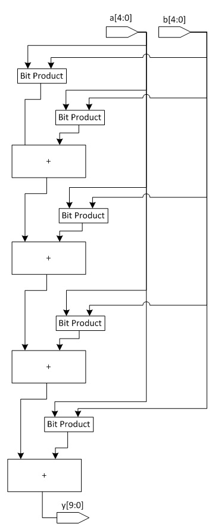

# L22 Homework

- Using the provided digital circuit:
  1. Identify the nodes that are affected by `PERIOD` constraints
  2. Identify the nodes that are affected by `OFFSET IN` constraints
  3. Identify the nodes that are affected by `OFFSET OUT` constraints
  4. With the below assumptions, write `PERIOD` and `OFFSET IN/OUT` constraints for the design to ensure it runs at 50 MHz.  Assume the clock signal is `clk`.
    1. It takes 4 ns for a signal to arrive at the input pin
    2. It takes 6 ns for a signal to reach the external memory chip we are to which we are sending data
  5. If the LUTs create a delay of 5 ns, the Adder delay is 10 ns, and the multiplier delay is 15 ns, what is the maximum overall propagation delay if you use the 50/50 rule?  In other words, what is the maximum clock period between synchronous elements?  Ignore setup and hold times.
- Draw the necessary additional hardware to pipeline the below 5-bit multiplier.  What other control signal(s) might you add to the multiplier in order to make it useful in a more general application?  What type of hardware would control the control signal(s)?

## Turn-In Requirements

1. Answers to the above questions
2. Simulation screenshots and source code where appropriate.
